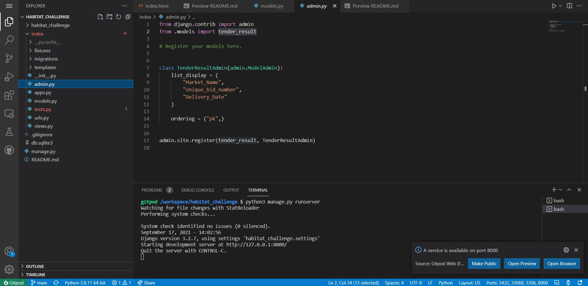

# Habitat Energy Challenge

The task I given was a backend technical challenge by habitat energy that reads and saves auction results from the national grid ESO data page and save the current day results to a local database. So, for this task I decided to use Django framework to read and save the data received from the ESO data page.

I attempted to get data using the URL endpoint form the API but got an error 409 conflict error, so if had access to the API of the national grid I could pull the data with “wget” command and pull the data without having to download the csv. Which led me to use Django as framework. The reason for choosing Django is that the admin can perform CRUD Operations on the data.

To get my code to function you’ll need to type in the terminal “python3 manage.py runserver” 

How the code works is that firstly install Django using “pip3 install Django” the terminal, after that enter commands “startproject” in the terminal to get the app running and place the necessary setting in place the create an app using “python3 manage.py startapp” command in the terminal to create the app where the database will be located and read from. 

For the app to read the data, I had to create a model that match the dataField of the data for each Header and change it the csv file header to a format that Django will accept. Then convert the csv file to a JSON file and make it a format that allow it me execute the “loaddata” command to upload the file to the Django Database.

Before all this I did create a superuser that allows the user to add, edit or delete any entry that is in the database. The credentials for the super user will be attached to and send through email.

To display data, I just set up a quick html page using jinja language, plus using bootstraps to get the card to neatly display each auction result.

If I had more time, I would have uploaded the code to Heroku so the app could be a live website so that to view the auction results all you’ll need is the URL. Allowing it to be updated on the daily basis and made the html more presentable/make it more user friendly by add a colour scheme the reflect Habitat Energy, changing the font, add pagination, and add a search function.